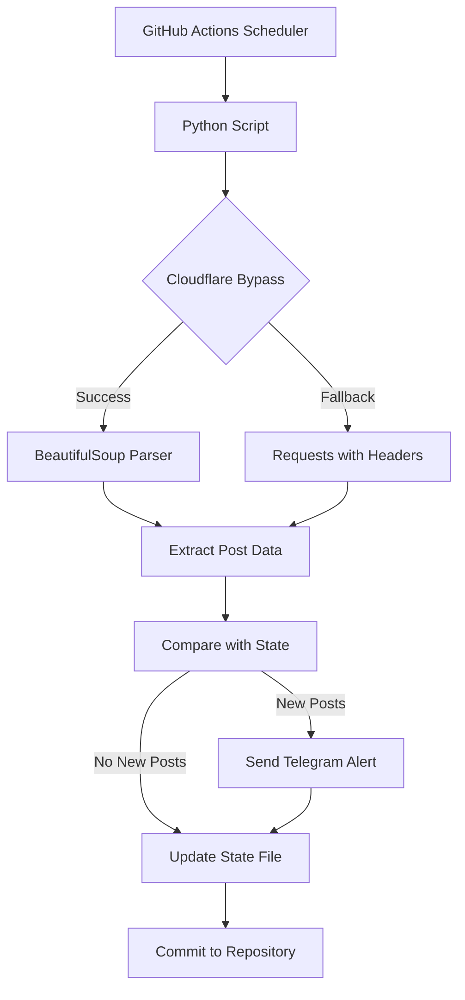

# 🚨 DeshiMula Review Monitor

<div align="center">


**An automated web scraper and notification system for monitoring new company reviews on DeshiMula.com**

[Features](#-features) • [Installation](#-installation) • [Configuration](#-configuration) • [Usage](#-usage) • [Automation](#-automation)

</div>

---

## 📋 Table of Contents

- [Overview](#-overview)
- [Features](#-features)
- [Architecture](#-architecture)
- [Installation](#-installation)
- [Configuration](#-configuration)
- [Usage](#-usage)
- [Automation with GitHub Actions](#-automation-with-github-actions)
- [File Structure](#-file-structure)
- [API Reference](#-api-reference)
- [Troubleshooting](#-troubleshooting)
- [Contributing](#-contributing)
- [License](#-license)

---

## 🎯 Overview

**DeshiMula Review Monitor** is a Python-based automation tool that continuously monitors [DeshiMula.com](https://deshimula.com/) for new company reviews and job experiences. When new content is detected, it automatically sends formatted notifications via Telegram, helping you stay updated with the latest workplace insights from the Bangladeshi job market.

### 🎪 What makes it special?

- **🛡️ Cloudflare Bypass**: Advanced scraping with `cloudscraper` to handle anti-bot protection
- **📱 Real-time Notifications**: Instant Telegram alerts for new reviews
- **🔄 Smart State Management**: Tracks seen posts to avoid duplicate notifications
- **⚡ GitHub Actions Integration**: Automated hourly monitoring in the cloud
- **🎯 Dual Mode Operation**: Monitor recent posts or scrape entire archive
- **💪 Robust Error Handling**: Retry mechanisms and fallback strategies

---

## ✨ Features

### 🔍 **Intelligent Web Scraping**
- **Multi-page Scraping**: Monitors first 5 pages for recent updates
- **Cloudflare Protection Bypass**: Uses advanced scraping techniques
- **Fallback Mechanisms**: Multiple request strategies for reliability
- **Rate Limiting**: Respectful scraping with built-in delays

### 📱 **Telegram Integration**
- **Rich Notifications**: Formatted messages with company, role, and review type
- **Rate Limit Handling**: Automatic retry with exponential backoff
- **Error Recovery**: Robust notification delivery system
- **Link Previews**: Direct links to full reviews

### 🔄 **State Management**
- **Persistent Storage**: JSON-based tracking of processed posts
- **Duplicate Prevention**: Intelligent ID-based comparison
- **Data Integrity**: Automatic backup of corrupted state files
- **Clean State Recovery**: Graceful handling of file corruption

### ⚙️ **Automation Ready**
- **GitHub Actions Workflows**: Pre-configured CI/CD pipelines
- **Scheduled Execution**: Hourly monitoring with cron jobs
- **Manual Triggers**: On-demand execution capabilities
- **Environment Security**: Secure handling of API credentials

---

## 🏗️ Architecture



### 🔧 **Core Components**

| Component | Purpose | Technology |
|-----------|---------|------------|
| **Web Scraper** | Extract review data from DeshiMula | `requests`, `cloudscraper`, `BeautifulSoup4` |
| **State Manager** | Track processed posts | JSON file storage |
| **Notification System** | Send alerts via Telegram | Telegram Bot API |
| **Scheduler** | Automate execution | GitHub Actions |

---

## 🚀 Installation

### Prerequisites

- **Python 3.7+**
- **Git** (for cloning)
- **Telegram Bot** (for notifications)
- **GitHub Account** (for automation)

### 1️⃣ Clone the Repository

```bash
git clone https://github.com/yourusername/DeshiMula-Update.git
cd DeshiMula-Update
```

### 2️⃣ Install Dependencies

```bash
pip install -r requirements.txt
```

### 3️⃣ Verify Installation

```bash
python --version  # Should be 3.7+
pip list          # Verify all packages installed
```

---

## ⚙️ Configuration

### 🤖 **Telegram Bot Setup**

1. **Create a Bot**:
   - Message [@BotFather](https://t.me/botfather) on Telegram
   - Send `/newbot` and follow instructions
   - Save your **Bot Token**

2. **Get Chat ID**:
   - Message [@userinfobot](https://t.me/userinfobot)
   - Note your **Chat ID**

### 🔐 **Environment Variables**

Create a `.env` file in the project root:

```env
# Telegram Configuration
TELEGRAM_TOKEN=your_bot_token_here
CHAT_ID=your_chat_id_here

# Optional: Custom Configuration
MAX_PAGES=5
BASE_URL=https://deshimula.com/
```

### 🔧 **GitHub Secrets** (for automation)

In your GitHub repository settings, add these secrets:

| Secret Name | Description | Example |
|-------------|-------------|---------|
| `TELEGRAM_TOKEN` | Your Telegram bot token | `123456789:ABCdefGHIjklMNOpqrsTUVwxyz` |
| `CHAT_ID` | Your Telegram chat ID | `123456789` |

---

## 📖 Usage

### 🎯 **Script Options**

#### **1st-dm-post.py** - Recent Posts Monitor
Monitors the first 5 pages for new reviews (recommended for regular monitoring).

```bash
python 1st-dm-post.py
```

**Features**:
- ✅ Monitors first 5 pages only
- ✅ Optimized for recent content
- ✅ Hourly automation ready
- ✅ Lower resource usage

#### **allpost.py** - Complete Archive Scraper
Scrapes all available pages starting from page 2 (use for initial setup or complete sync).

```bash
python allpost.py
```

**Features**:
- ✅ Scrapes entire website archive
- ✅ Skips first page (handled by main monitor)
- ✅ Manual trigger only
- ✅ Comprehensive data collection

### 📊 **Sample Output**

```
🔍 DeshiMula Review Monitor Started - 2024-08-27 22:39:32

🌐 Checking for new posts from first 5 pages...
🌐 Fetching URL: https://deshimula.com/
🛡️ Attempting Cloudflare bypass with cloudscraper...
📡 Cloudscraper - Response status: 200
📄 Response length: 45678 characters
🔍 Found 12 post containers on this page
✅ Page 1: Found 12 posts

📊 Found 3 new posts to process
📝 Processing #1: Software Engineer Experience at ABC Company
✅ Telegram notification sent: Software Engineer Experience at ABC Company
💾 Updated seen posts file - stored 60 total posts
✅ Monitoring complete - 3 notifications sent
```

### 📱 **Telegram Notification Format**

```
🚨 New Review Alert! #1

📝 Title: Software Engineer Experience at ABC Company
🏢 Company: ABC Technology Ltd
💼 Role: Software Engineer
🏷️ Type: Job Experience, Salary Info

🔗 View Full Post
```

---

## 🤖 Automation with GitHub Actions

### ⏰ **Scheduled Monitoring** (`run-1st-dm.yml`)

**Automatically runs every hour** to check for new reviews:

- **Schedule**: Every hour at minute 0 (`0 * * * *`)
- **Manual Trigger**: Available via GitHub Actions UI
- **Auto-commit**: Updates state files automatically

### 🔧 **Manual Archive Sync** (`run-allpost.yml`)

**Manual trigger only** for complete data synchronization:

- **Trigger**: Manual execution only
- **Purpose**: Initial setup or complete resync
- **Safety**: Prevents accidental resource-intensive runs

### 🚀 **Workflow Features**

| Feature | Description |
|---------|-------------|
| **Auto-commit** | Automatically commits state changes |
| **Error Handling** | Graceful failure recovery |
| **Environment Isolation** | Secure credential management |
| **Logging** | Detailed execution logs |

---

## 📁 File Structure

```
DeshiMula-Update/
├── 📄 README.md                    # This documentation
├── 📋 requirements.txt             # Python dependencies
├── 🚫 .gitignore                   # Git ignore rules
├── 
├── 🐍 Python Scripts
│   ├── 1st-dm-post.py             # Main monitoring script
│   ├── 1st-dm-post-cpy.py         # Backup/development copy
│   └── allpost.py                  # Complete archive scraper
│
├── 📊 Data Files
│   ├── seen_posts.json            # State tracking (auto-generated)
│   └── all_posts.json             # Complete archive (auto-generated)
│
└── 🔄 GitHub Actions
    └── .github/workflows/
        ├── run-1st-dm.yml          # Hourly monitoring workflow
        └── run-allpost.yml         # Manual archive sync workflow
```

### 📋 **File Descriptions**

| File | Purpose | Auto-Generated |
|------|---------|----------------|
| `1st-dm-post.py` | Main monitoring script for recent posts | ❌ |
| `allpost.py` | Complete archive scraper | ❌ |
| `seen_posts.json` | Tracks processed posts to avoid duplicates | ✅ |
| `all_posts.json` | Complete archive of all scraped posts | ✅ |
| `requirements.txt` | Python package dependencies | ❌ |

---

## 🔧 API Reference

### 🎯 **Core Functions**

#### **Web Scraping**

```python
def get_page_posts(page_url: str) -> List[Dict]
```
**Purpose**: Scrape posts from a single page with Cloudflare bypass
**Returns**: List of post dictionaries with title, link, company, role, badges

#### **State Management**

```python
def load_seen_posts() -> Optional[List[Dict]]
def save_seen_posts(posts: List[Dict]) -> None
```
**Purpose**: Manage persistent state to track processed posts

#### **Notifications**

```python
def send_telegram_alert(title: str, link: str, company: str, 
                       role: str, badges: List[str], count: int = None) -> bool
```
**Purpose**: Send formatted notification via Telegram with retry logic

### 📊 **Data Structures**

#### **Post Object**
```python
{
    "id": "unique_post_identifier",
    "title": "Review title",
    "link": "https://deshimula.com/post/123",
    "company": "Company Name",
    "role": "Job Role",
    "badges": ["Job Experience", "Salary Info"]
}
```

### ⚙️ **Configuration Constants**

| Constant | Default Value | Description |
|----------|---------------|-------------|
| `BASE_URL` | `https://deshimula.com/` | Target website URL |
| `MAX_PAGES` | `5` | Number of pages to monitor |
| `STATE_FILE` | `seen_posts.json` | State persistence file |

---

## 🔍 Troubleshooting

### ❌ **Common Issues**

#### **1. Environment Variables Not Set**
```
ERROR: Missing environment variables!
```
**Solution**: Create `.env` file with `TELEGRAM_TOKEN` and `CHAT_ID`

#### **2. Cloudflare Protection**
```
⚠️ Cloudscraper failed: 403 Forbidden
```
**Solution**: Script automatically falls back to requests with headers

#### **3. Rate Limiting**
```
⏳ Rate limited. Waiting 30 seconds before retry...
```
**Solution**: Script handles this automatically with exponential backoff

#### **4. JSON Corruption**
```
⚠️ JSON decode error: Expecting value
```
**Solution**: Script automatically backs up corrupted file and starts fresh

### 🔧 **Debug Mode**

Enable verbose logging by modifying the script:

```python
import logging
logging.basicConfig(level=logging.DEBUG)
```

### 📞 **Getting Help**

1. **Check Logs**: Review GitHub Actions logs for detailed error information
2. **Validate Setup**: Ensure all environment variables are correctly set
3. **Test Manually**: Run scripts locally to isolate issues
4. **Check Dependencies**: Verify all packages are installed correctly

---

## 🤝 Contributing

We welcome contributions! Here's how you can help:

### 🛠️ **Development Setup**

1. **Fork the repository**
2. **Create a feature branch**: `git checkout -b feature/amazing-feature`
3. **Make your changes**
4. **Test thoroughly**
5. **Submit a pull request**

### 📝 **Contribution Guidelines**

- **Code Style**: Follow PEP 8 standards
- **Documentation**: Update README for new features
- **Testing**: Ensure all functionality works as expected
- **Commit Messages**: Use clear, descriptive commit messages

### 🎯 **Areas for Contribution**

- **New Notification Channels** (Discord, Slack, Email)
- **Enhanced Filtering** (Company-specific, role-based)
- **Web Dashboard** (Real-time monitoring interface)
- **Database Integration** (PostgreSQL, MongoDB support)
- **Performance Optimization** (Async scraping, caching)

---

## 📄 License

This project is licensed under the **MIT License** - see the [LICENSE](LICENSE) file for details.

### 📋 **License Summary**

- ✅ **Commercial Use**: Use in commercial projects
- ✅ **Modification**: Modify and distribute
- ✅ **Distribution**: Share with others
- ✅ **Private Use**: Use for personal projects
- ❌ **Liability**: No warranty provided
- ❌ **Trademark Use**: No trademark rights granted

---

## 🙏 Acknowledgments

- **[DeshiMula.com](https://deshimula.com/)** - For providing valuable workplace insights
- **[Telegram Bot API](https://core.telegram.org/bots/api)** - For notification infrastructure
- **[GitHub Actions](https://github.com/features/actions)** - For automation platform
- **Open Source Community** - For the amazing tools and libraries

---

## 📊 Project Stats


---

<div align="center">

**Made with ❤️ for the Bangladeshi Tech Community**

[⭐ Star this project](https://github.com/khalakuzamanrony/DeshiMula-Update) if you find it helpful!

</div>
